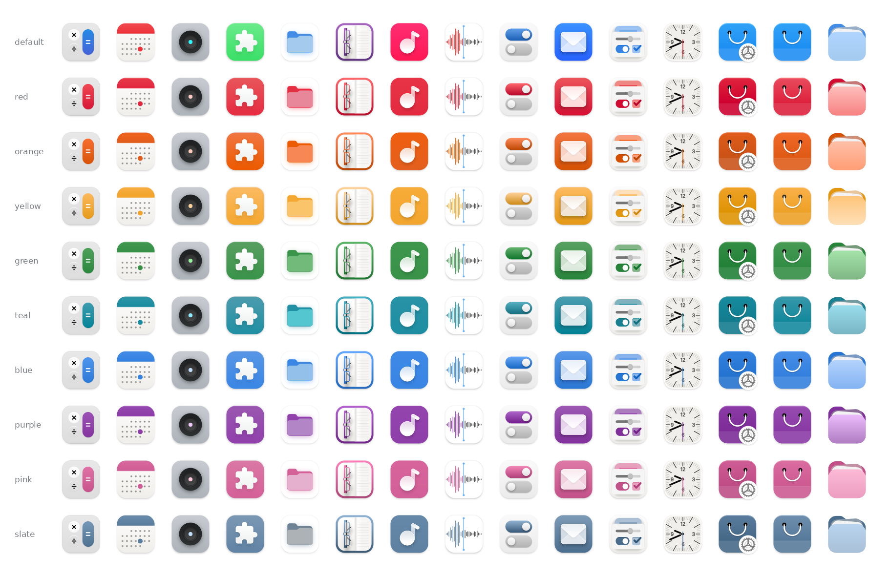
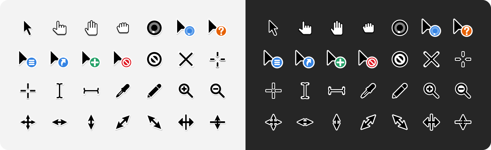

# Adwair

A refined icon theme blending the polished look of WhiteSur with the clean, native feel of Adwaita.


## Installation

### Automatic installation

Clone the repository and run the installer:

```bash
git clone https://github.com/kusaida/Adwair.git
cd Adwair
chmod +x install.sh
./install.sh
```

Two themes are installed:

```text
~/.local/share/icons/Adwair       # light app icons
~/.local/share/icons/Adwair-dark  # dark app icons, inherits Adwair
```

After installation, select **Adwair** as your icon theme, or **Adwair-dark** for dark app icons.

### Manual installation

If you prefer not to use the installer, copy the contents of `src` directly into your local icon theme directory:

```bash
mkdir -p ~/.local/share/icons/Adwair
cp -r src/. ~/.local/share/icons/Adwair/
```

Then select **Adwair** as your icon theme.

This installs the light theme only. The installer additionally builds `Adwair-dark` from `make/generator/dark`.

### Installation options

The installer supports colored folder variants and custom installation names. Dark app icons are always installed as a separate `NAME-dark` theme that inherits the base theme.

```text
   -c, --color COLOR    Use a colored places variant (default: blue).
                        Accepts the full name or an unambiguous prefix,
                        case-insensitive:
                          b, blue     g, green    o, orange
                          p, pink     pu, purple  r, red
                          s, slate    t, teal     y, yellow
                          
   -n, --name NAME      Theme folder name (default: Adwair)
                        The dark variant is installed as NAME-dark
   
   -p, --path PATH      Base installation path (default: ~/.local/share/icons)
                        The theme is installed into PATH/NAME
                        
   -a, --apps           Also install colored app icons into apps/scalable,
                        using the color from -c (default: blue)
                        
   -f, --folder-icons   Run the custom folder icons generator after install
```

#### Colored folders

```bash
./install.sh -c COLOR
```

`-c` defaults to blue, so a plain `./install.sh` already installs blue folders.


#### Colored folders and app icons

```bash
./install.sh -c COLOR -a
```



## Cursor theme

A modernized Adwaita cursor theme with HiDPI support. It is already included and installed with the icon theme, just select **Adwair** as the cursor theme in **Refine** or **GNOME Tweaks**, the same way as the icon theme.



<details>
<summary>Animated cursors</summary>


</details>

## Custom folders

The `-f` / `--folder-icons` option runs the custom folder icon generator after installation.

The generator scans directories on the system and automatically assigns matching folder icons based on their names.

For example:
- `github` → `folder-github`
- `Downloads` → `folder-downloads`
- `Pictures` → `folder-pictures`

This allows folders to automatically receive themed icons without manually changing them one by one.

```bash
# Teal folders with a custom theme name and run the folder generator
./install.sh -c t -n MyIcons -f
```

## Credits

Adwair is a derivative work based on and incorporating modified artwork from the following projects:

- [WhiteSur Icon Theme](https://github.com/vinceliuice/WhiteSur-icon-theme) by vinceliuice — GPL-3.0
- [Hatter](https://github.com/Mibea/Hatter) by Mibea — GPL-3.0
- [MoreWaita](https://github.com/somepaulo/MoreWaita) by somepaulo — GPL-3.0
- [Adwaita Icon Theme](https://gitlab.gnome.org/GNOME/adwaita-icon-theme) by the [GNOME Project](https://www.gnome.org) — used under LGPL-3.0

### Modifications

- **App icons:** based on WhiteSur, with extensive modifications and additions.
- **Some app icons:** based on Hatter and adapted to the WhiteSur style.
- **Symbolic icons:** from Adwaita and MoreWaita.
- **Cursors:** modernized Adwaita cursor theme with HiDPI support.
- **Folder icons:** modified Adwaita artwork combined with Adwaita symbolic icons.
- Several app icons are original artwork.

## License

Adwair is licensed under the [GPL-3.0](LICENSE).
