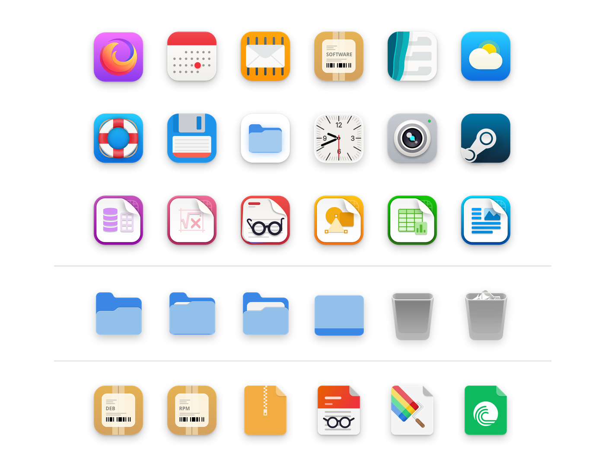
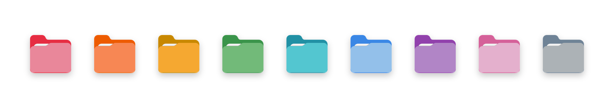

# Adwair

A refined icon theme blending the polished look of WhiteSur with the clean, native feel of Adwaita.



## Installation

### Automatic installation

Clone the repository and run the installer:

```bash
git clone https://github.com/kusaida/Adwair.git
cd Adwair
chmod +x install.sh
./install.sh
```

The theme will be installed to:

```text
~/.local/share/icons/Adwair
```

After installation, select **Adwair** as your icon theme.

### Installation options

The installer supports colored folder variants and custom installation names.



```text
  -c, COLOR     Use a colored places variant:
                      b, blue     g, green    o, orange
                      p, pink     pu, purple  r, red
                      s, slate    t, teal     y, yellow

  -n, NAME      Change icon theme folder name ~/.local/share/icons/NAME

  -f,           Run the custom folder icons generator after install

  -h,           Show this help message
```

## Custom folders

The `-f` / `--folders` option runs the custom folder icon generator after installation.

The generator scans directories on the system and automatically assigns matching folder icons based on their names.

For example:
- `github` → `folder-github`
- `Downloads` → `folder-downloads`
- `Pictures` → `folder-pictures`

This allows folders to automatically receive themed icons without manually changing them one by one.

```
# Teal folders with a custom theme name and run the folder generator 
./install.sh -c t -n MyIcons -f
```

### Manual installation

If you prefer not to use the installer, copy the contents of `src` directly into your local icon theme directory:

```bash
mkdir -p ~/.local/share/icons/Adwair
cp -r src/. ~/.local/share/icons/Adwair/
```

Then select **Adwair** from your desktop environment's icon theme settings.

## Credits

Based on **WhiteSur** and **Hatter icon** themes.

* App icons: based on WhiteSur, with extensive modifications and additions.
* Symbolic icons: Adwaita and MoreWaita.
* Folder icons: modified Adwaita artwork with Adwaita symbolic icons.
* Some app icons: based on Hatter and adapted to the WhiteSur style.
* Several app icons are original artwork.


